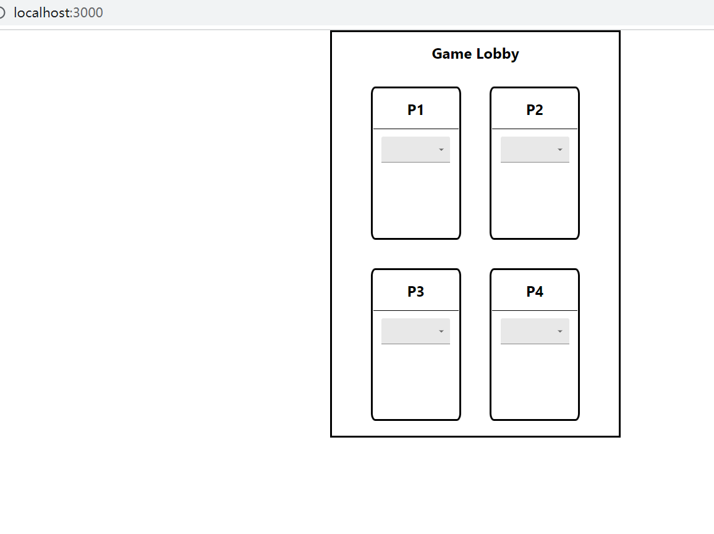
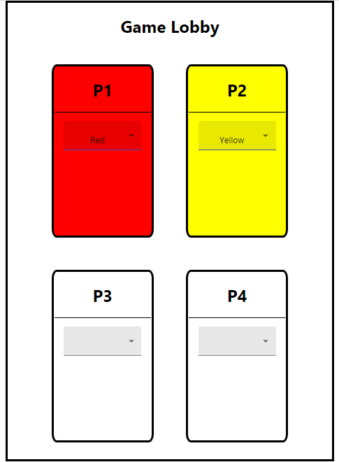
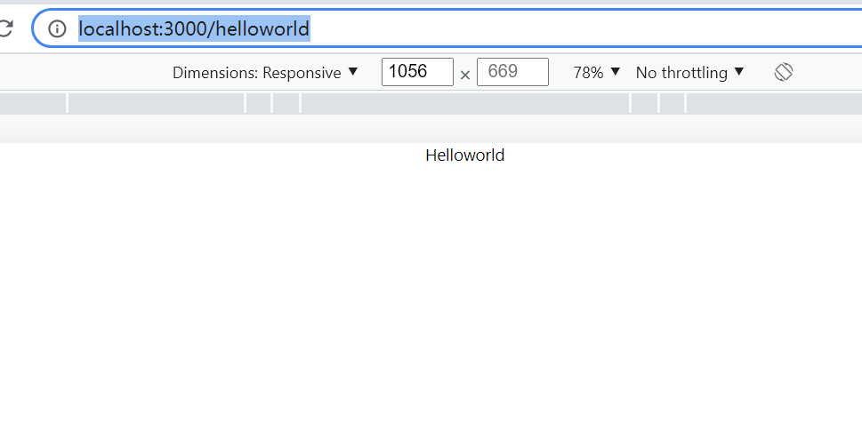

# Getting Started with Create React App

This project was bootstrapped with [Create React App](https://github.com/facebook/create-react-app).

## Available Scripts

In the project directory, you can run:

### `npm start`

Runs the app in the development mode.\
Open [http://localhost:3000](http://localhost:3000) to view it in your browser.

The page will reload when you make changes.\
You may also see any lint errors in the console.

After launching the app in the browser, you should be able to see the page below:

There are four players. Each player should be able to choose different colors from other players:

If a player chooses the same color as others, then he cannot actually pick that color

Besides that, there areactually two URLs in this webpage, the default URL is the page with the game lobby. The other URL is as following:

http://localhost:3000/helloworld

with the following page
