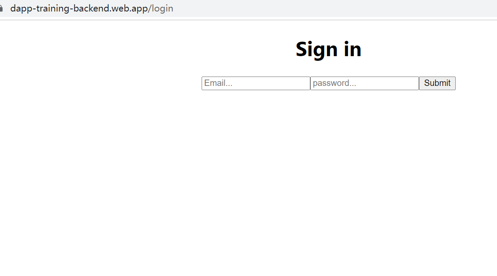
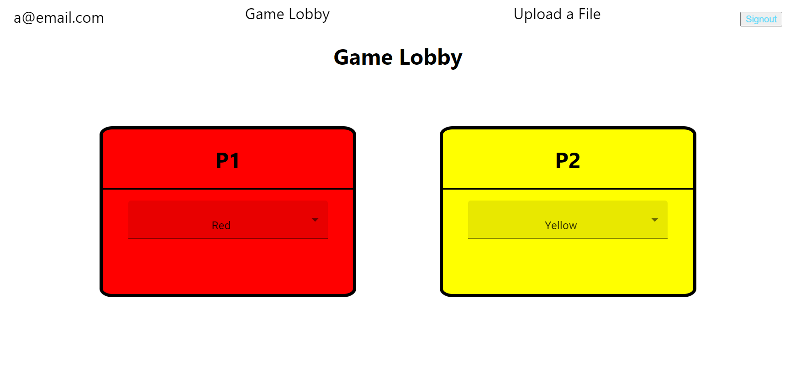
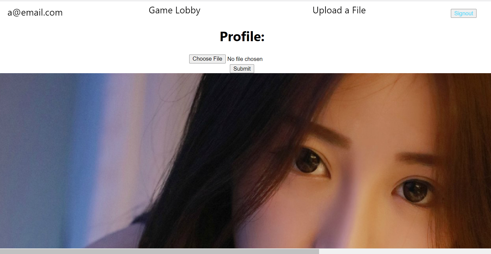

# Phase 1

This project was bootstrapped with [Create React App](https://github.com/facebook/create-react-app).

## Available Scripts

In the project directory, you can run:

### `npm start`

Runs the app in the development mode.\
Open [http://localhost:3000](http://localhost:3000) to view it in your browser.

The page will reload when you make changes.\
You may also see any lint errors in the console.

After launching the app in the browser, you should be able to see the page below:

There are four players. Each player should be able to choose different colors from other players:

If a player chooses the same color as others, then he cannot actually pick that color

Besides that, there areactually two URLs in this webpage, the default URL is the page with the game lobby. The other URL is as following:

http://localhost:3000/helloworld

with the following page

# Phase 2

> This phase is consisting of two repos:
>
> Frontend: https://github.com/junior-stack/peer_training
>
> Backend cloud function: https://github.com/junior-stack/peer_backend_training.git

The frontend is right now accessed through this URL:

https://dapp-training-backend.web.app/login

## Authentication

The user cannot will be redirected to the login page if they do not input their emails and passwords

The accounts for this website are the followings:

+ email: a@email.com password: 123456
+ email: b@email.com password: 123456
+ email: c@email.com password: 123456

## Persistence

The colos users have selected are stored in the firestore. When a user logs out and logs in, he will see the colors he has selected. The corresponding cloud function at the backend is `getAllColors`

When a user changes a color, it will update the data within the fire store through cloud function `updateColor`

## Upload

The user could see the profile picture theu have uploaded before. The corresponding cloud function is `getProfile`

+ log in as a@email.com and the profile picture is shown:

  

The user could upload their profile pictures to the firebase storage and set their profile picture url in the collection of userProfile in firestore through cloud function: `uploadPicture`

